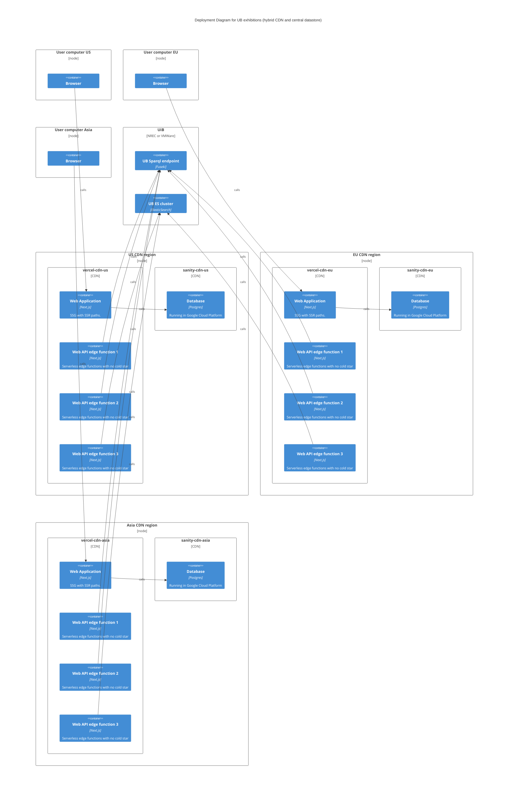

# Platform

Vercel is the preferred deployment platform for `chc-monorepo` because of the CDN and serverless/edge functions. Data comes from Sanity.io and local UiB-UB datastores.

The diagram below shows some issues in the current deployment. Everything in this monorepo is written to be run in the cloud, but will use datasources that is not distributed.

